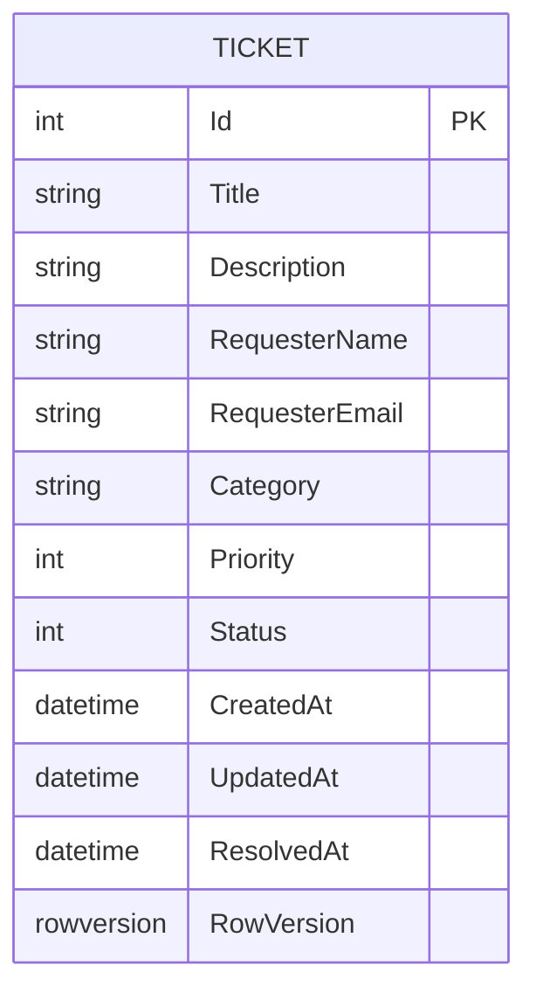

# HelpDesk Lite

HelpDesk Lite is a small web-based ticket management system built as a professional portfolio project. It models a basic Level 1 technical support workflow: users create incidents, support staff prioritize them, update their status and track resolution dates.

## Implemented features

- Create support tickets.
- View and search tickets.
- Filter by status and priority.
- Edit ticket details, status and priority.
- Track creation, update and resolution timestamps.
- Delete tickets.
- View a dashboard with summary counters and recent activity.
- Server-side validation and optimistic concurrency support.

## Technology stack

- .NET 10
- ASP.NET Core MVC
- Entity Framework Core 10
- SQL Server / SQL Server Express
- C#
- HTML and CSS

## Project structure

```text
HelpDeskLite/
├── Controllers/
├── Data/
├── Models/
├── ViewModels/
├── Views/
├── wwwroot/
├── Program.cs
└── appsettings.json
```

## Database model



## Run locally

### Requirements

- .NET 10 SDK
- SQL Server Express or SQL Server Developer
- Visual Studio with the ASP.NET and web development workload, or Visual Studio Code

### Local setup

See [Guía de instalación](docs/SETUP_ES.md) for the Spanish setup guide.

1. Use SQL Server Express with Windows Authentication.
2. Set `ConnectionStrings:DefaultConnection` for your SQL Server instance.
3. Use a new development database for the first run of this consolidated copy.
4. Open `HelpDeskLite.sln`, restore packages and run the HTTPS profile.

The included migration is applied automatically on startup. Do not generate a second `InitialCreate` migration.

```powershell
dotnet restore
dotnet build --no-restore
$env:ConnectionStrings__DefaultConnection='Server=.\SQLEXPRESS;Database=HelpDeskLitePortfolioDb;Trusted_Connection=True;TrustServerCertificate=True;MultipleActiveResultSets=true'
dotnet run --project HelpDeskLite --launch-profile https
```

This is a local portfolio application. Authentication and user roles are not implemented.

## Roadmap

### Planned improvements

- ASP.NET Core Identity authentication.
- Roles for Administrator, Technician and Requester.
- Ticket assignment.
- Comments and internal notes.
- Ticket history.

### Later improvements

- Dashboard charts and service metrics.
- SLA deadlines.
- Exportable reports.
- Automated tests.
- Deployment to a cloud platform.

## Learning objectives

This project is designed to demonstrate:

- MVC architecture.
- Relational data modeling.
- CRUD operations.
- Entity Framework Core.
- Technical support workflow concepts.
- Input validation and error handling.
- Git and GitHub documentation practices.

## Author

Jafeth Alejandro David Ríos  
Computer Systems Engineering Student
GitHub: [jafethrios](https://github.com/jafethrios)
